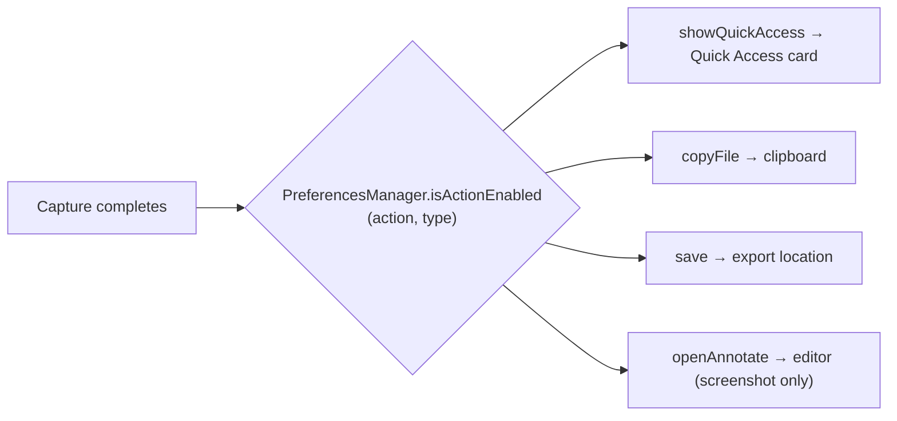

# Preferences

Reference for the Settings window: tab structure, every section, and how preferences are stored. Verified against `Snapzy/Features/Preferences/` at HEAD (`v2.1.0-beta.1`).

## Root

- `PreferencesView` (`Snapzy/Features/Preferences/PreferencesView.swift`) — SwiftUI `NavigationSplitView` sidebar layout, resizable (default 800×620, min 700×520), 11 categories in 4 unlabelled groups.
- `PreferencesWindowController` (`Snapzy/Features/Preferences/PreferencesWindowController.swift`) — Dedicated `NSWindowController` directly managing window lifecycle, activation policy transitions (`.regular` ↔ `.accessory`), fullSizeContentView, and titlebar transparency.
- Selection driven by `PreferencesNavigationState.shared.selectedTab` (`Models/PreferencesNavigationState.swift`, `PreferencesTab` enum) — supports back/forward history stacks (`⌘[` and `⌘]`), last-visited tab persistence, and programmatical routing from menu bar, deep links (`snapzy://settings?tab=`, see [SHORTCUTS.md](SHORTCUTS.md)), and the shortcut overlay.

## Storage pattern

- Simple prefs: `@AppStorage(PreferencesKeys.*)` directly in views; keys centralized in `Snapzy/Features/Preferences/Models/PreferencesKeys.swift`.
- Complex structured prefs: `PreferencesManager.shared` (`PreferencesManager.swift`) behind the `PreferencesProviding` protocol (`PreferencesProviding.swift`) for DI.
- TOML export/import covers most prefs — see [CONFIGURATION.md](CONFIGURATION.md).

## Tabs

### General (`PreferencesGeneralSettingsView.swift`)

- **Startup**: Start at Login (`LoginItemManager` / SMAppService), Play Sounds (`playSounds`), Show Menu Bar Icon (`showMenuBarIcon`).
- **Appearance**: Language row (`PreferencesLanguageSettingRow`), theme picker (`AppearanceModePicker` → `appearanceMode`).
- **Storage**: Save Location (`exportLocation` + `exportLocation.bookmark`, via `SandboxFileAccessManager`).
- **Updates**: Check Automatically / Download Automatically (bound to `SPUUpdater`), Last Checked — see [UPDATES.md](UPDATES.md).
- **Help**: Restart Onboarding (`OnboardingFlowView.resetOnboarding()` + `.showOnboarding`), Report Issue (opens bug-report page; full bundle flow in [UPDATES.md](UPDATES.md)).

### Menu Bar (`PreferencesMenuBarSettingsView.swift`)

- **Menu Bar Icon**: label-less tile picker for the status item icon — bundled default, built-in SF Symbol alternates (`camera.viewfinder`, `camera.fill`, `scissors`, `photo.on.rectangle`), or a custom PNG. The custom slot is a dashed "+" add tile: click opens an `NSOpenPanel`, or drop a PNG onto it; the file is validated, copied to `Application Support/Snapzy/MenuBarIcon/custom.png`, alpha-bounds normalized, and rendered as a monochrome template. Replace/Remove controls appear while custom is selected. Backed by `MenuBarIconStyle` + `MenuBarIconRenderer` (`menuBar.iconStyle`).
- **Capture / Recording / Tools**: per-item visibility toggles and drag-to-reorder within each section, backed by `MenuBarCustomizationStore` (`menuBar.itemOrder`, `menuBar.hiddenItems`). Hidden features remain available via keyboard shortcuts and the `snapzy://` URL scheme; group order and separators are fixed (separators render only between non-empty groups).
- **App**: Check for Updates visibility toggle (fixed position; Preferences and Quit are pinned and not customizable).
- **Reset to Defaults** restores order, visibility, and the bundled icon.

### Capture (`PreferencesCaptureSettingsView.swift`)

Segmented into four panes (`CaptureSettingsPane`): General / Screenshot / Recording / OCR.

- **General pane**:
  - App Windows: Include Snapzy windows in screenshots (`screenshot.includeOwnApp`) / in recordings (`recording.includeOwnApp`).
  - Desktop: Hide Desktop Icons (`hideDesktopIcons`), Hide Desktop Widgets (`hideDesktopWidgets`).
  - Overlay: Show Selection Area Overlay (`screenshot.showSelectionAreaOverlay`) — in live passthrough sessions the dim appears from capture start when this is on (already-visible hover UI stays alive but looks dimmed until the drag cutout).
  - Magnifier: Reverse Magnifier Zoom Direction (`screenshot.reverseMagnifierZoomDirection`).
  - Output Naming: screenshot/recording file-name templates (`screenshot.fileNameTemplate`, `recording.fileNameTemplate`) with token list + live preview + reset.
  - After Capture: action matrix (see below) + Auto-Crop Subject (`backgroundCutout.autoCropEnabled`).
- **Screenshot pane**:
  - Format: Show Cursor (`screenshot.showCursor`), Freeze Area (`screenshot.freezeArea`), Hover Passthrough (`screenshot.livePassthrough`, requires Accessibility), Image Format (`screenshot.format`, `ImageFormatOption`; WebP shows a warning, JPEG a cutout note).
  - Preset: default annotate canvas preset (`PreferencesScreenshotDefaultPresetPicker`).
  - Scrolling Capture: Show Session Hints (`scrollingCapture.showHints`) + info note.
- **Recording pane**:
  - Format: MOV / MP4 (`recording.format`).
  - Quality: Frame Rate 30/60 (`recording.fps`), Quality (`recording.quality`, `VideoQuality`), Max Resolution (`recording.maxResolution`, `RecordingMaxResolution`, default `auto`).
  - Behavior: Show Cursor (`recording.showCursor`), Dim Non-Selected Area (`recording.dimNonSelectedArea`, default on — darkens everything outside the recording region during recording; turn off to keep other windows fully visible/usable while recording), Remember Last Area (`recording.rememberLastArea`).
  - Controls: Hover Bar Visible (`recording.hoverBarVisible`), Show Time on Menu Bar (`recording.showTimeOnMenuBar`).
  - Mouse Highlight: size 30–100, animation 0.3–2.0 s, ripple count 1–5, color (archived `NSColor` in `recording.mouseHighlight.color`), opacity 0.2–1.0; reset-to-default.
  - Keystroke Overlay: font size 12–32, position (`KeystrokeOverlayPosition`), display duration 0.5–5.0 s; reset-to-default.
  - Audio: System Audio (`recording.captureAudio`), Microphone (`recording.captureMicrophone`, runs `AVCaptureDevice` authorization flow with System Settings fallback), Mic Input device picker (`recording.microphoneDeviceID`).
- **OCR pane**:
  - OCR Model: active recognition provider (`PreferencesOCRModelListView` + `Models/PreferencesOCRModelListViewModel`; selection persisted in `ocr.selectedModel` as `builtin` | `custom:<uuid>`).
    - Built-in OCR is Apple Vision (default, always available).
    - Add Custom Model opens `PreferencesCustomOCRModelSheet` (name, base URL, model identifier, optional prompt, optional API key stored in the macOS Keychain — service `com.trongduong.snapzy.ocr`; Test Connection; edit/rename/test/remove; metadata JSON in `ocr.customModels`).
    - A removed or unavailable custom endpoint falls back to Built-in OCR (`OCRModelResolver`). Legacy downloadable selections are treated as Built-in OCR.
  - Notifications: OCR Notifications (`ocr.successNotificationEnabled`, default on — posts a native macOS notification with a preview of the recognized text; falls back to an in-app toast when notifications are unavailable). When the toggle is on, an inline row surfaces the macOS-level permission only when it would block delivery: `notDetermined` shows an "Allow" button that triggers the system prompt in place, `denied` shows an orange hint plus "Open Settings". A granted (or unavailable) state renders nothing, so a healthy setup stays uncluttered. The row refreshes on `NSApplication.didBecomeActiveNotification`, so returning from System Settings updates it.
  - Text Actions: Link Detection (`ocr.linkDetectionEnabled`).

### Annotate (`PreferencesAnnotateSettingsView.swift`)

- Behavior section only:
  - Sync Tool Defaults / quick-properties sync (`annotate.quickPropertiesSyncEnabled`, default on).
  - Combine Save-as-Edit (`annotate.combineSaveAsEdit`, default on).
  - Crop Snap to Edges (`annotate.cropSnapToEdgesEnabled`, default on; also togglable from the crop toolbar; ⌘ held during a drag temporarily bypasses).
  - Snap Highlight to Text (`annotate.highlighterTextSnappingEnabled`, default on; also togglable from the highlighter quick-properties bar; aligns highlighter drags to detected text lines, ⌘ held during a drag temporarily bypasses).
  - Clipboard image open behavior (`annotate.clipboardImageOpenBehavior`): `ask` (default) / `loadAutomatically` / `doNothing` (`AnnotateClipboardImageBehavior`).
  - Close After Drag (`annotate.closeAfterDrag`, default on).
  - Bring Forward After Drag (`annotate.bringForwardAfterDrag`, default off; disabled when Close After Drag is on).

### Quick Access (`PreferencesQuickAccessSettingsView.swift`)

- **Actions**: `QuickAccessActionCustomizationView` — action enable/order/slot assignment with live preview card (`PreferencesQuickAccessPreviewCard`); keys `quickAccess.actions.*`, `quickAccess.swipe.action.*`.
- **Pinned Image**: zoom mode picker (`quickAccess.pin.zoom.mode`) selects fixed viewport (default) or window-follows-image; an animated side-by-side preview shows how each mode changes the pin window and image.
- **Position**: screen edge left/right (`floatingScreenshot.position`).
- **Appearance**: overlay size slider 0.75–1.5 (`floatingScreenshot.overlayScale`).
- **Behaviors**: floating overlay enable (`floatingScreenshot.enabled`), Auto-Close toggle + 3–30 s slider (default 10, `floatingScreenshot.autoDismiss*`) + Pause on Hover, Hide Card When Window Open (`quickAccess.hideCardWhenWindowOpen`), Animation Style (`quickAccess.animationStyle`), Sound Effects (`quickAccess.playSounds`), Drag & Drop (`floatingScreenshot.dragDropEnabled`), Two-Finger Swipe to Dismiss + sensitivity 0.5–3.0 (`floatingScreenshot.twoFingerSwipe*`).
- **Trackpad Swipe Mode**: mode picker (`quickAccess.trackpad.swipe.mode`) + swipe-action hints; visible when swipe-to-dismiss is on.

### History (`PreferencesHistorySettingsView.swift`)

- **Floating Panel**: enable (`history.floating.enabled`), Panel Position (`history.floating.position`).
- **Display**: Default Filter (all/screenshots/videos/gifs), Background Style (`history.backgroundStyle`, thumbnail picker), Panel Size scale slider (`history.floating.scale`), Max Items 3–20 (`history.floating.maxDisplayedItems`).
- **Retention**: Retention Days 0–90, 0 = keep forever (`history.retentionDays`), Max Count 0–1000, 0 = unlimited (`history.maxCount`).
- **Storage**: capture storage size + Open Capture Storage (`CaptureStorageManager`), Clear History with confirmation (`HistoryWindowController.deleteRecords`).
- Master history enable (`history.enabled`) seeded on; see [APP_LIFECYCLE.md](APP_LIFECYCLE.md) for seeded defaults.

### Shortcuts (`PreferencesShortcutsSettingsView.swift`)

- Master toggle (`shortcutsEnabled`).
- Grouped recorders with per-shortcut enable toggles and per-section Reset: Capture, Recording, Tools, History, Quick Access, Quick Access Card Actions, Annotate Actions, Annotate Tool Keys; Reset to Defaults (all).
- Quick Access Card Actions (`PreferencesQuickAccessActionShortcutsSection.swift`): master toggle plus one recorder per card action, active only while a card is hovered.
- System-conflict guidance via `SystemScreenshotShortcutManager`.
- Full mechanics and default bindings: [SHORTCUTS.md](SHORTCUTS.md).

### Permissions (`PreferencesPermissionsSettingsView.swift`)

- Rows with status labels + System Settings deep links:
  - Screen Recording → `Privacy_ScreenCapture`
  - Save Folder → `Privacy_FilesAndFolders`
  - Microphone → `Privacy_Microphone`
  - Accessibility → `Privacy_Accessibility`
- Shows `grantedButUnavailableDueToAppIdentity` when `AppIdentityManager` reports issues (see [APP_LIFECYCLE.md](APP_LIFECYCLE.md)).

### Cloud (`PreferencesCloudSettingsView.swift`)

Provider configuration, credentials, expiration, usage stats, and the Cloud Uploads window. Summary only here — full reference in [CLOUD.md](CLOUD.md).

### Advanced (`PreferencesAdvancedSettingsView.swift`)

- **Backup**: TOML Import / Export / Restore Defaults (`SnapzyConfiguration*` services).
- **Configuration File**: grant access to `~/.config/snapzy`, Sync Now, Open Config, status/issues — see [CONFIGURATION.md](CONFIGURATION.md).
- **Integration**: URL Scheme toggle (`urlSchemeEnabled`).
- **Diagnostics**: enable toggle (`diagnostics.enabled`), retention days (`diagnostics.retentionDays`, default 3, range 1–30 via `LogCleanupScheduler`), Open Folder (`~/Library/Logs/Snapzy`) — see [UPDATES.md](UPDATES.md).

### About (`PreferencesAboutSettingsView.swift`)

- Hero: app icon/name/subtitle, then version+build + last update check, then the liquid-glass **Check for Updates** button (disabled while Sparkle is checking).
- Creator attribution ("Made by") & Special thanks section honoring contributors (featured list in default view with inline "See more" expansion to all-time contributors using `PreferencesFlowLayout`, individual GitHub profile links for each contributor, and repository contributors anchor link).
- Card 2: inline update channel picker — stable/beta; support link rows (website, GitHub, Report a Bug, Discord, sponsor) — see [UPDATES.md](UPDATES.md).

## After-capture matrix

- `AfterCaptureAction` (4 cases) × `CaptureType` (2: screenshot, recording) — defined in `PreferencesManager.swift`.
- Defaults: `showQuickAccess`, `copyFile`, `save` = on for both types; `openAnnotate` = off (opt-in, screenshot-only).
- Stored as JSON `[String: [String: Bool]]` under UserDefaults key `afterCaptureActions`; load failures fall back to seeded defaults.
- Edited via `PreferencesAfterCaptureMatrixView.swift` (Capture → General pane).
- **Removed at `dd4ccd5`**: the `uploadToCloud` after-capture auto-upload case no longer exists. Manual cloud uploads remain (Quick Access, Annotate ⌘U, Video Editor, History) — see [CLOUD.md](CLOUD.md).

## Related docs

- [SHORTCUTS.md](SHORTCUTS.md) — shortcut mechanics, defaults, conflicts
- [CLOUD.md](CLOUD.md) — Cloud tab + uploads window
- [UPDATES.md](UPDATES.md) — update channel, diagnostics, problem reporting
- [APP_LIFECYCLE.md](APP_LIFECYCLE.md) — seeded defaults, activation policy, onboarding
- [CONFIGURATION.md](CONFIGURATION.md) — TOML backup/sync of these prefs
- [QUICK_ACCESS.md](QUICK_ACCESS.md) — overlay behavior details
- [HISTORY.md](HISTORY.md) — retention and storage internals
