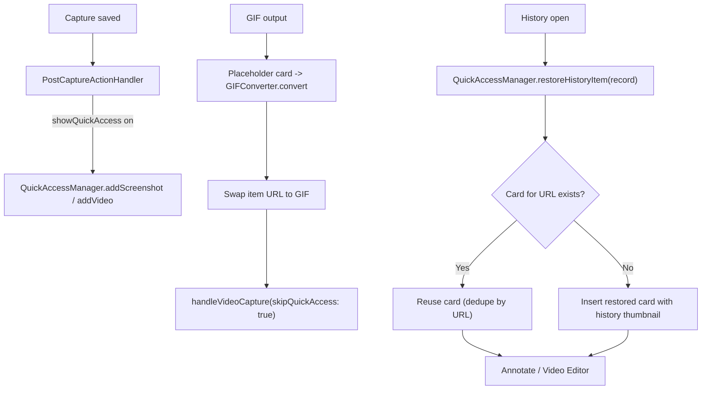

# Quick Access

Floating post-capture card stack: appears after every screenshot/video/GIF when the `showQuickAccess` after-capture action is on, offering hover actions, gestures, countdown auto-dismiss, pin windows, and the entry point into Annotate / Video Editor / cloud upload. Code lives in `Snapzy/Features/QuickAccess/`.

## Panel

- `QuickAccessPanel` — borderless `.nonactivatingPanel` NSPanel at `.floating` level; mouse-passthrough outside the card region (`updatePassthroughRegion`, `ignoresMouseEvents` toggled by hit-test).
- Show/hide transitions (`QuickAccessPanelController`) cannot wedge: a `show()`/`hide()` landing mid-transition force-closes the superseded panel instead of being dropped, and a watchdog force-completes any transition whose `NSAnimationContext` completion handler is dropped by AppKit (token-guarded, first finish wins). `QuickAccessManager` re-ensures the panel on every added card (`showPanelIfNeeded`), so a desynced panel self-heals on the next capture.
- `QuickAccessManager` — singleton stack state; `maxVisibleItems = 5`, newest at top; oldest evicted when full.
- Mouse monitors suspended during area capture (`suspendForCapture()` → panel + pin windows). Self-heal: `setWindowOpen(isOpen: false)` (editor window closed) reinstalls the panel's monitors — macOS can silently disable the global event tap after a runloop stall, which otherwise leaves hover dead.
- Slide-in animation: spring 0.4s (`QuickAccessAnimations.panelEnter`, damping 0.75); falls back to fade under reduceMotion. Appear sound via `QuickAccessSound`.
- Card hide/reappear (editor open/close) is driven by a SINGLE animation source: `QuickAccessStackView.animation(value: visibleItems.count)` — `QuickAccessManager.setWindowOpen` deliberately does NOT wrap its mutation in `withAnimation` (two compounding springs caused reappear jank).
- Position: 4-corner model `QuickAccessPosition`; prefs UI exposes left/right (bottom corners). Overlay scale 0.75–1.5 step 0.25 (`overlayScale`, scales `QuickAccessLayout` 180×112 base). Animation style slide/scale (`quickAccess.animationStyle`).
- Multi-display (#467): the panel is pinned to the display it appeared on (`QuickAccessScreenAnchor`, resolved by `CGDirectDisplayID`), and every later reposition — corner change, overlay resize, slide-out — targets that anchored screen, so moving the cursor to another display never teleports a visible panel. Each new capture re-anchors it: `showPanelIfNeeded` calls `moveToActiveScreenIfNeeded()`, which replays the slide-in on the capture display when the cursor has moved to a different one (instant jump under reduceMotion). Anchor falls back to the active screen if the display is unplugged. A panel mid slide-out is not reusable (`isDismissing`) — that path gets a fresh `showPanel()` instead, so a capture landing during the exit is never swallowed.

## Card Anatomy

- 180×112 pt base (`QuickAccessLayout.cardWidth/cardHeight`), scaled by overlay scale; 8pt spacing, stack scale/opacity falloff per card.
- `QuickAccessCardView` — thumbnail (`QuickAccessThumbnailGenerator`), duration badge for videos, pin indicator, progress overlays (`QuickAccessProgressView`): GIF conversion spinner/ring/check/fail and cloud upload states.
- Hover → dim + up to 2 center text buttons + up to 4 corner icon buttons (staggered reveal). Double-click opens the editor; right-click context menu mirrors actions, destructive group last.
- Assigned-but-unavailable actions (already-uploaded cloud, screenshot-only on video) stay visible disabled.

## Actions

`QuickAccessActionKind` (7, all live): `copy`, `saveOrOpen`, `dismiss`, `delete`, `edit`, `uploadToCloud`, `pinToScreen`.

Default slots (`QuickAccessActionSlot.defaultAssignments`): centerTop copy, centerBottom saveOrOpen, topTrailing dismiss, topLeading delete, bottomLeading edit, bottomTrailing uploadToCloud. `pinToScreen` unassigned by default.

| Action | Behavior |
| --- | --- |
| `copy` | Clipboard copy + dismiss; temp file kept on disk for paste-time reads (orphans cleaned next launch) |
| `saveOrOpen` | Temp: `TempCaptureManager.saveToExportLocation` move + history path update + annotation/video-editor sidecar move. Saved: reveal in Finder |
| `dismiss` | Card removed; temp file deleted unless a history record exists or the general pasteboard still references the file (#234 paste-integrity guard) |
| `delete` | Removes history record + annotation sidecar, deletes temp or trashes saved file, deletes recording metadata for videos |
| `edit` | Opens Annotate (screenshots) or Video Editor (video/GIF); pauses countdown. Video Editor restores its persisted cut/zoom/speed recipe when available. Editor Save commits to the current file and leaves a temporary card available for this card's later Save action |
| `uploadToCloud` | Manual `CloudManager.upload`, copies public link, deletes old key on re-upload; gated by `CloudManager.isConfigured` |
| `pinToScreen` | Opens always-on-top pin window (screenshots only) |

Keyboard: hovering a card arms its action shortcuts (⌘C copy, ⌘S save/open, ⌘E edit, ⌘U upload, ⌘P pin, ⌘⌫ delete, ⌘W dismiss). Bindings are routed only while `QuickAccessManager.hoveredItemID` is set, matched against the full key code + modifier set, and exact matches route back into `performAction` so keyboard and click share one path. Unregistered combinations always pass through to the focused app. Full mechanics, teardown paths, and validation rules: [SHORTCUTS.md](SHORTCUTS.md).

Customization: `QuickAccessActionConfigurationStore` — context-menu order (`quickAccess.actions.order.v1`), enabled set (`...enabled.v1`), slot assignments (`...slots.v1`). Settings → Quick Access preview card supports drag-to-slot + swipe zones + reset. Note: commit `dd4ccd5` removed only the after-capture auto-upload preference option; the manual `uploadToCloud` card action stays, additionally gated by `isEnabled(.uploadToCloud)`.

## Gestures

`QuickAccessDraggableView`:

- Mouse drag: 30pt direction threshold; drag toward panel edge = swipe-dismiss; drag away = drag-to-app file drag.
- Two-finger trackpad swipe: `QuickAccessTrackpadSwipeHelpers`, dismiss at distance 80 / velocity 300, sensitivity 0.5–3.0 multiplier; mode natural/inverted (`quickAccess.trackpad.swipe.mode`, default inverted).
- Per-direction action assignment via `QuickAccessSwipeActionStore` (`quickAccess.swipe.action.left/right`, both default dismiss).

## Auto-Dismiss Countdown

- `autoDismissDelay` 3–30s, default 10; pause on hover `pauseCountdownOnHover` default on.
- Countdown pauses while editing / GIF-converting / cloud-uploading, resumes when work finishes (`pauseCountdownForEditingItem` pauses the edited item + all newer items).
- Pinned items bypass the countdown.

## Pin Windows

- `QuickAccessPinWindowManager` + `QuickAccessPinWindow` + `QuickAccessPinWindowState` — screenshots only, always-on-top.
- Zoom presentation is selected in Settings → Quick Access → Pinned Image. `QuickAccessPinZoomModeStore` persists `fixedViewport` by default or `windowFollowsImage`; a setting change resets zoom/pan and updates all open pins while preserving their centers.
- Both modes use `NSScrollView` for image display. Pinch events are handled by the image document view over the image and by the scroll view over empty viewport space. Pinch zoom is clamped to 0.4x–8x, with 800% in the capsule menu. Fit returns to 100%; window-follows-image mode restores its initial window size, and fixed mode centers the image.
- Window follows image: the initial image keeps its aspect ratio and fits within 80% of the screen’s visible area. At 40% zoom, the window keeps a 240×180 minimum interactive frame and centers the image at its selected magnification, so exact pointer anchoring gives way to centering while the image is smaller than that minimum frame. Pinch and vertical scrolling zoom at the pointer and resize the window around that focal point; horizontal scrolling does not zoom. Images remain within the window, so image panning is unnecessary.
- Fixed viewport: the initial image is scaled to at most 80% of the screen width and the viewport height is capped at 80% of the visible screen. Unmodified precise two-finger scrolling pans only when the image overflows. Modifier-key and coarse scrolling do not manipulate the image. Pan is clamped to image bounds, centering axes where the image is smaller.
- Lock mode: click-through except the unlock button; image fades to 0.18 on hover. Locked pins reject zoom and pan. A normal one-finger background drag moves the unlocked window; Esc closes an unlocked pin.
- The Quick Access preferences compare both modes with a synchronized SwiftUI illustration of a fictional long page. The page is drawn from shapes and contains no bundled screenshot or photo.
- Drag-out handle (`QuickAccessPinDragHandleView`) re-exports the current rendered image to `Captures/PinDrags/` — saved edits included even while file write is in flight.
- Closing unpins the QA item and restarts its countdown. Transient `pinScreenshot(url:)` supports pinning arbitrary files.

## Flow In

- See [POST_CAPTURE.md](POST_CAPTURE.md) for the routing matrix, [RECORDING.md](RECORDING.md) for the GIF swap, [HISTORY.md](HISTORY.md) for restore.
- Clipboard copy runs before Quick Access work so pasteboard updates stay immediate. Exception: the re-copy after an EDITED save runs off-main (decode/encode in background, serialized) and lands ~100-300ms after the window closes — keeps the card reappear stall-free.
- Save/copy/drag of a pinned screenshot pushes the new render into the open pin window as soon as the background render completes (~50-100ms after save-and-close). The instant 200px anti-flash thumbnail is card-only and is never sent to the pin window (pin sizing derives from the full-res image).

## Editor Session Handoff

- Opening Annotate or Video Editor associates the window with the Quick Access item, hides that card, and pauses the item countdown plus newer cards.
- Editor Save is an in-place commit. For a temporary capture, the edited media stays at its temp URL and the card remains the owner of promotion. For a saved capture, Replace Original writes to the existing destination; Save As Copy is an explicit alternate.
- Video Editor sessions persist a versioned recipe plus a private unrendered source snapshot. Reopening the card or a matching History record restores the cut/trim sequence, zoom blocks, speed blocks, and export context so another edit can continue from the original source.
- When a temp card is promoted, `QuickAccessManager` moves the video-editor session package from the temp path to the saved destination. Deleting the card removes the package; retention cleanup removes packages whose media is no longer active.
- The card is refreshed while the editor is still hidden, then reappears only after the editor closes. Thumbnail and URL updates preserve the item’s window, pin, processing, and cloud state.
- Editing a cloud-linked capture marks its old cloud object stale; the card’s upload action can re-upload the edited file. Dismissing the card still controls session-cache cleanup and temp-file lifecycle.

## Preferences Surface

Settings → Quick Access: position (left/right), overlay size, sound effects, auto-close delay + pause on hover, two-finger swipe (mode, sensitivity, per-direction actions), action customization. See [PREFERENCES.md](PREFERENCES.md).

## Related docs

- [POST_CAPTURE.md](POST_CAPTURE.md) — after-capture routing into Quick Access
- [CAPTURE.md](CAPTURE.md) — capture flows producing cards
- [RECORDING.md](RECORDING.md) — GIF conversion placeholder swap
- [ANNOTATE.md](ANNOTATE.md) — edit action, sidecars, drag-to-app
- [VIDEO_EDITOR.md](VIDEO_EDITOR.md) — video/GIF editor entry
- [HISTORY.md](HISTORY.md) — restore-to-Quick-Access flow
- [CLOUD.md](CLOUD.md) — manual upload gating
- [PREFERENCES.md](PREFERENCES.md) — settings keys
